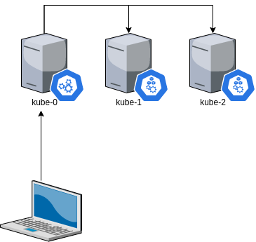
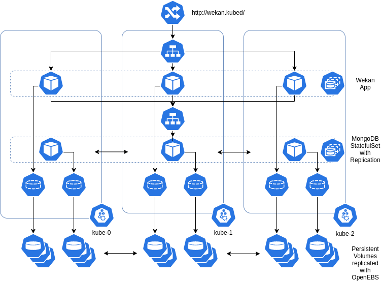
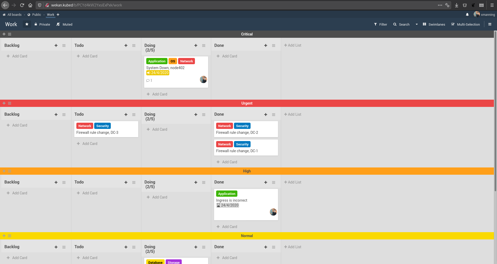

# Kubernetes Cluster on OpenSUSE built with Vagrant and Ansible
## Code to Kubernetes in 15 minutes.

### Introduction

I decided to build my own Kubernetes cluster using Vagrant and Ansible as part
of my experiences learning how to Operate a Kubernetes Cluster.

**NOTE, this is not a production cluster!**

### Why?

Whilst learning to administrate Kubernetes with Minikube is a great starting
point, I wanted to start learning how to provision and administrate a cluster,
in particular a "bare-metal" cluster.

To make things easy, I have used my K3s role to configure this as a Rancher
K3s cluster.

If you are wanting to run your applications on K8s, I would recommend a provider
such as AWS, Azure or GCP - it's a lot easier from an operational point of view.

### What?

To try and get the "bare-metal" experience, Vagrant and Ansible deploys the
following:

  - 3 worker nodes:
    - OpenSUSE
    - 2 vCPU
    - 2048 MiB Memory
    - RAID 10 for local storage.
  - 1 control node (one of the workers)
  - Rancher k3s
  - Flannel (CNI)
  - MetalLB (Load Balancer)
  - OpenEBS (Storage)

### Architecture

The cluster is composed of Kubernetes nodes (1 control plane worker, 2 workers).

This Kubernetes cluster is Rancher K3s running on OpenSUSE with Flannel as the
Container Network Interface (CNI). Storage is local but can be replicated using
OpenEBS's Jiva storage.



### Requirements

1. Ansible 2.8+
1. Vagrant 2.0+
1. VirtualBox
1. Kubectl
1. A machine that can run 3 VMs comfortably (Core i7 w/ 16GB RAM Recommended):
   1. 3x (2GB Kubernetes Nodes, 2 vCPU)

### Running

To run the cluster, simply do the following:

  1. `./go.sh`

### Deploying a test app

We are going to be deploying Wekan, a Trello-like Kanban board. This will be
composed of the 2 StatefulSets (app tier and database tier) backed by OpenEBS
replicated storage.



#### 0. Set KUBECONFIG to use the Vagrant cluster config

In your current terminal, in the project directory run:

```bash
export KUBECONFIG=config
```

Check that the config works with `kubectl cluster-info`, you should get an
output such as the below:

```text
Kubernetes master is running at https://10.10.9.2:6443
CoreDNS is running at https://10.10.9.2:6443/api/v1/namespaces/kube-system/services/kube-dns:dns/proxy
Metrics-server is running at https://10.10.9.2:6443/api/v1/namespaces/kube-system/services/https:metrics-server:/proxy

To further debug and diagnose cluster problems, use 'kubectl cluster-info dump'.
```

#### 1. Check the cluster

We need to ensure that all the pods are started for Kubernetes, Flannel,
Metallb and OpenEBS are started.

Run: `kubectl get pods -o wide --all-namespaces`

Each pod should appear as Running or Completed

```text
NAMESPACE        NAME                                           READY   STATUS      RESTARTS   AGE     IP          NODE     NOMINATED NODE   READINESS GATES
kube-system      metrics-server-6d684c7b5-jp5kx                 1/1     Running     0          4m14s   10.42.0.4   kube-0   <none>           <none>
kube-system      local-path-provisioner-58fb86bdfd-66t2d        1/1     Running     0          4m14s   10.42.0.2   kube-0   <none>           <none>
kube-system      helm-install-traefik-wvgtt                     0/1     Completed   0          4m15s   10.42.0.5   kube-0   <none>           <none>
kube-system      coredns-6c6bb68b64-dv2cn                       1/1     Running     0          4m14s   10.42.0.3   kube-0   <none>           <none>
kube-system      traefik-7b8b884c8-2vxhh                        1/1     Running     0          3m37s   10.42.0.6   kube-0   <none>           <none>
metallb-system   controller-65895b47d4-sn72f                    1/1     Running     0          2m45s   10.42.0.8   kube-0   <none>           <none>
openebs          openebs-ndm-m2ztt                              1/1     Running     0          2m43s   10.10.9.2   kube-0   <none>           <none>
openebs          openebs-snapshot-operator-857784956d-gjqq8     2/2     Running     0          2m43s   10.42.2.3   kube-2   <none>           <none>
metallb-system   speaker-z2q5h                                  1/1     Running     0          2m45s   10.10.9.2   kube-0   <none>           <none>
metallb-system   speaker-5ms9d                                  1/1     Running     0          2m44s   10.10.9.3   kube-1   <none>           <none>
metallb-system   speaker-kfzj5                                  1/1     Running     0          2m44s   10.10.9.4   kube-2   <none>           <none>
openebs          openebs-localpv-provisioner-6f979cfcb9-6htlv   1/1     Running     0          2m43s   10.42.1.4   kube-1   <none>           <none>
openebs          openebs-provisioner-594c8c7974-bjxsd           1/1     Running     0          2m43s   10.42.2.2   kube-2   <none>           <none>
openebs          openebs-ndm-fvgsn                              1/1     Running     0          2m43s   10.10.9.4   kube-2   <none>           <none>
openebs          openebs-ndm-qvj7h                              1/1     Running     0          2m43s   10.10.9.3   kube-1   <none>           <none>
openebs          openebs-admission-server-7849ff844d-sxldj      1/1     Running     0          2m43s   10.42.1.5   kube-1   <none>           <none>
openebs          maya-apiserver-697dcb9ff4-9n9mm                0/1     Running     2          2m43s   10.42.1.2   kube-1   <none>           <none>
openebs          openebs-ndm-operator-7bcd4c77ff-xg7lg          1/1     Running     1          2m43s   10.42.1.3   kube-1   <none>           <none>
```

#### 2. Prepare your `/etc/hosts` file

We are using a Traefik ingress controller to access the Wekan application.
The DNS name we are using is http://wekan.kubed/, Traefik will have an IP of
10.10.9.150 as deployed by Metallb, so you will need a line in your /etc/hosts
file as per the below:

```text
$ grep wekan /etc/hosts
10.10.9.150  wekan.kubed
```

#### 3. Deploy the application.

To deploy Wekan, run `kubectl apply -f wekan.yaml`

```text
$ kubectl apply -f wekan.yaml

serviceaccount/wekandb-view created
clusterrolebinding.rbac.authorization.k8s.io/wekandb-view created
statefulset.apps/wekandb created
statefulset.apps/wekan created
service/wekan-svc created
service/wekandb created
ingress.networking.k8s.io/wekan-ingress created
```

The above is happening in the default namespace, to change namespaces you
will need to modify the service account in `wekan.yaml`.

To watch the deployment, run: `kubectl get pods -w -o wide`

**Note**: A number of Persistent Volume Claims (PVCs) will crash and relaunch,
I'm fairly new to OpenEBS but this seems to be OK as the volumes will
eventually sort themselves out.

#### 4. Test the application

Go to http://wekan.kubed/ and create an account, take a look around and
play.


